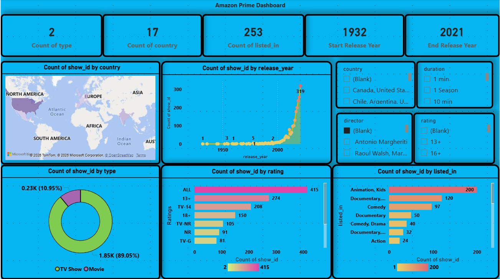

# Amazon Sales Analysis Using Power BI

## 📁 Projects Overview

**Domain:** Sales
**Tools Used:** Power BI 

#### 📌 Problem Statement
Briefly describe the business problem or objective of this project.

#### 📊 Dataset
- Source: (Kaggle / Company Data / Public Dataset)
- Description: Short explanation of the dataset

#### 🔍 Key Analysis Performed
- Data cleaning and preprocessing
  
- Exploratory Data Analysis (EDA)
- KPI calculation
- Trend and performance analysis

#### 📈 Dashboard / Visualizations
**Power BI Dashboard:**



> *(Replace the path with your actual image file location)*

#### 📄 Full Project Report
- 📎 [Click here to view full project report](reports/project1_report.pdf)

#### 💡 Key Insights
- Insight 1
- Insight 2
- Insight 3

---

### 🔹 Project 2: <Project Title>

**Domain:**  
**Tools Used:**  

#### 📌 Problem Statement
Describe the problem.

#### 📊 Dataset
- Source:
- Description:

#### 🔍 Key Analysis Performed
- 
- 
- 

#### 📈 Dashboard / Visualizations


#### 📄 Full Project Report
- 📎 [View Project Report](reports/project2_report.pdf)

#### 💡 Key Insights
- 
- 
- 

---

## 📂 Repository Structure

```text
├── PowerBI_Projects/
├── Excel_Projects/
├── SQL_Projects/
├── Tableau_Projects/
├── images/
│   ├── project1_dashboard.png
│   ├── project2_dashboard.png
├── reports/
│   ├── project1_report.pdf
│   ├── project2_report.pdf
└── README.md
